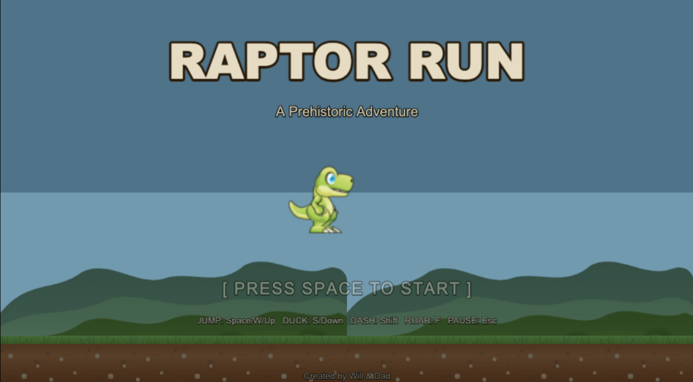
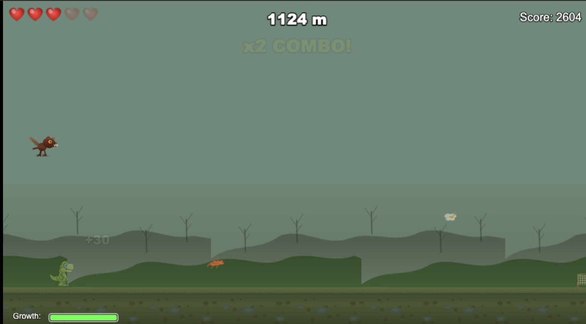

# Raptor Run

A 2D side-scrolling dinosaur adventure game where you play as a baby velociraptor, eating food, dodging hazards, and evolving through three growth stages.

**Created by Will Rathbone (age 8) -- his first game!**





## How to Play

You're a baby velociraptor running through a prehistoric world. Eat food to grow, dodge obstacles, and survive as long as you can!

### Controls

| Action | Keys |
|---|---|
| Jump | Space / W / Up |
| Duck | S / Down |
| Dash | Shift (Juvenile+) |
| Roar | F / Enter (Adult only) |
| Pause | Esc |

### Growth Stages

1. **Hatchling** -- Small and fast. 2 HP. Double jump.
2. **Juvenile** -- Bigger and tougher. 3 HP. Unlocks **Dash** (brief invincibility burst).
3. **Adult** -- Full size. 5 HP. Unlocks **Roar** (destroys nearby obstacles).

Eat food to fill the growth meter. When it's full, you evolve!

### Dinosaur Enemies

New species appear as you travel further:

| Distance | Enemy | Watch out for... |
|---|---|---|
| Start | Pterodactyl | Bobs up and down in the air |
| Start | Triceratops | Charges fast along the ground |
| 300m | Compsognathus Pack | 3-4 tiny dinos in a spread formation |
| 600m | Dimorphodon | Dive-bombs from above |
| 1000m | Stegosaurus | Tall plates -- duck or dash! |
| 1500m | Dilophosaurus | Stands still and spits venom |
| 2000m | Ankylosaurus | Armored -- immune to Roar! |
| 3000m | T-Rex | Chase sequence -- survive 11 seconds! |

You can also jump on **logs** and **benches** to use them as platforms.

### Biomes

The world changes as you run:
- **Jungle** (start) -- Lush green hills
- **Swamp** (1000m) -- Murky and green
- **Volcano** (2500m) -- Orange and fiery
- **Caves** (5000m) -- Dark and mysterious

## Running the Game

```bash
npm install
npm run dev
```

Then open http://localhost:5173 in your browser.

## Building

```bash
npm run build
```

Output goes to the `dist/` folder.

## Tech Stack

- [Phaser 3](https://phaser.io/) -- Game framework
- TypeScript
- Vite -- Build tool
- All dinosaur art is procedurally generated using Canvas2D

## Credits

- Game design and playtesting: **Will Rathbone**
- Raptor sprite: pzUH ([OpenGameArt](https://opengameart.org/content/free-dino-sprites), CC0)
- Pterodactyl sprite: firestorm200 ([OpenGameArt](https://opengameart.org/content/2d-dinosaur-set), CC0)
